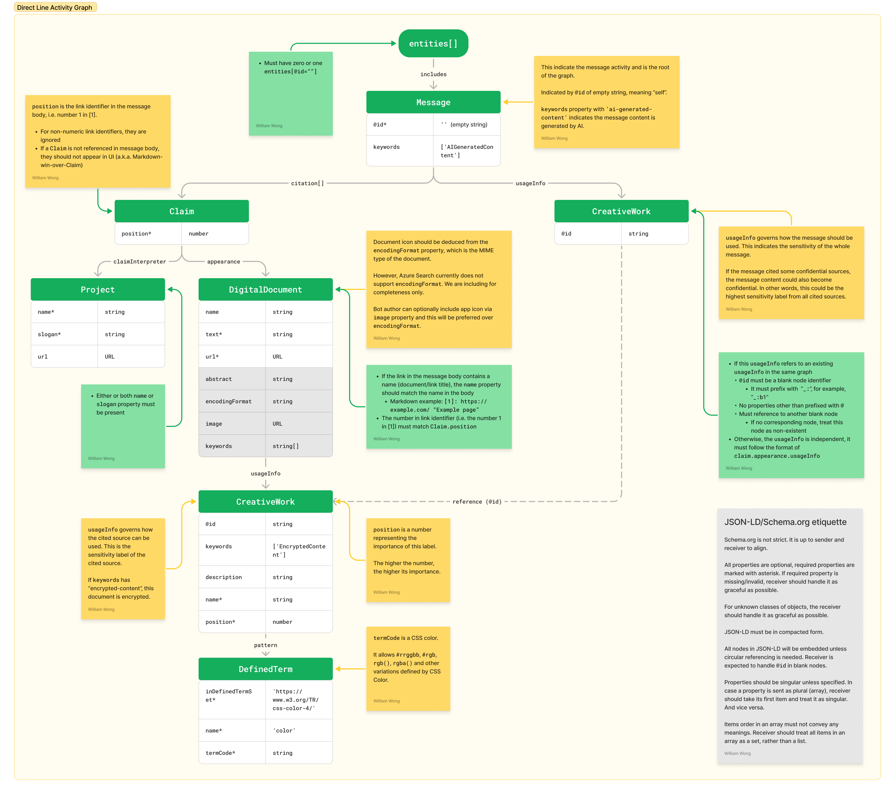

# Citation

This document describes how citation works in Web Chat.

## Background

Adding citation in a message helps customers better understand the response.

Web Chat added citation support since [4.16.0](../CHANGELOG.md#4160---2023-11-16).

## Terminology

### Markdown reference style link

A type of link in Markdown that is located below the paragraph. It would reduce repetitiveness when multiple words shared the same link and improve readability.

### Sensitivity label

Additional metadata can be added to indicate how the content of the link should be used.

## Bot implementation

Bot developers would need to implement the citation as outlined in this section. The implementation below will enable livestreaming to both Azure Bot Services and Teams.

## Non-URL citation

Citation which does not have a link to point the user to. But part or whole of the cited content is attached in the activity.

### Activity text

-  It must be in Markdown format
-  It must use reference style link

#### Sample payload

Notes:

-  The third citation is a non-URL citation, its link `cite:1` is currently ignored

```md
Sure, you should override the default proxy settings[1]​[2], when your proxy server requires authentication[3].

[1]: https://support.microsoft.com/en-us/windows/use-a-proxy-server-in-windows-03096c53-0554-4ffe-b6ab-8b1deee8dae1 'Use a proxy server in Windows'
[2]: https://learn.microsoft.com/en-us/troubleshoot/windows-server/networking/configure-proxy-server-settings 'Configure proxy server settings - Windows Server'
[3]: cite:1 'Introduction Configuring proxy settings is a fundamental aspect...'
```

### Message object



Please refer to the graph for details of each fields. Notably:

-  Only compact from is supported (i.e. nested objects), other forms and object references are not supported unless stated otherwise
-  Subclasses are not supported. If the object is expected to be `Message`, it must not be `EmailMessage` (subclass)

#### Sample payload

```json
{
   "@context": "https://schema.org",
   "@id": "",
   "@type": "Message",
   "citation": [
      {
         "@id": "https://support.microsoft.com/en-us/windows/use-a-proxy-server-in-windows-03096c53-0554-4ffe-b6ab-8b1deee8dae1",
         "@type": "Claim",
         "appearance": {
            "@type": "DigitalDocument",
            "encodingFormat": "application/vnd.openxmlformats-officedocument.wordprocessingml.document",
            "url": "https://support.microsoft.com/en-us/windows/use-a-proxy-server-in-windows-03096c53-0554-4ffe-b6ab-8b1deee8dae1",
            "usageInfo": {
               "@type": "CreativeWork",
               "additionalType": "https://copilotstudio.microsoft.com/sensitivity-labels/v1",
               "name": "General"
            }
         },
         "claimInterpreter": {
            "@type": "Project",
            "slogan": "Surfaced with Azure OpenAI",
            "url": "https://www.microsoft.com/en-us/ai/responsible-ai"
         },
         "position": "1"
      },
      {
         "@id": "https://learn.microsoft.com/en-us/troubleshoot/windows-server/networking/configure-proxy-server-settings",
         "@type": "Claim",
         "appearance": {
            "@type": "DigitalDocument",
            "dateModified": "2024-03-01T15:56:27.000-0800",
            "editor": "William Wong",
            "encodingFormat": "application/vnd.openxmlformats-officedocument.wordprocessingml.document",
            "url": "https://learn.microsoft.com/en-us/troubleshoot/windows-server/networking/configure-proxy-server-settings"
         },
         "claimInterpreter": {
            "@type": "Project",
            "slogan": "Surfaced with Azure OpenAI",
            "url": "https://www.microsoft.com/en-us/ai/responsible-ai"
         },
         "position": "2"
      },
      {
         "@id": "_:c1",
         "@type": "Claim",
         "appearance": {
            "@type": "DigitalDocument",
            "abstract": "Aute Lorem id laboris Lorem do dolor mollit. Officia dolore dolor do culpa nostrud velit officia...",
            "encodingFormat": "text/markdown",
            "name": "Sample Citation From File",
            "text": "Aute Lorem id laboris Lorem do dolor mollit. Officia dolore dolor do culpa nostrud velit officia magna ut aute pariatur excepteur ut cupidatat.",
            "usageInfo": {
               "@id": "_:s1",
               "@type": "CreativeWork",
               "additionalType": "https://copilotstudio.microsoft.com/sensitivity-labels/v1",
               "description": "Data is classified as Confidential but is NOT PROTECTED to allow access by approved NDA business partners. If a higher level of protection is needed please change the sensitivity level of the cited content.",
               "keywords": ["EncryptedContent"],
               "name": "Confidential\\Any User (No Protection)",
               "pattern": {
                  "@type": "DefinedTermSet",
                  "inDefinedTermSet": "https://www.w3.org/TR/css-color-4/",
                  "name": "color",
                  "termCode": "orange"
               }
            }
         },
         "claimInterpreter": {
            "@type": "Project",
            "slogan": "Surfaced with Azure OpenAI",
            "url": "https://www.microsoft.com/en-us/ai/responsible-ai"
         },
         "position": "3"
      }
   ],
   "keywords": ["AIGeneratedContent"],
   "type": "https://schema.org/Message",
   "usageInfo": {
      "@id": "_:s1"
   }
}
```

## Design decisions

### Markdown reference style link

This type of link allows multiple words/badges to reference to the same link, which is common when citing sources. It also helps readability when users are on text channels (email/SMS).

According to CommonMark, Markdown engines should not render the reference style links separately. Channels which does not support citation should continue rendering links normally.

Web Chat appended an additional UI component below the Markdown component. It visualizes the reference style link in a footnote fashion and render sensitivity labels and other UIs.

### Markdown pure identifiers for badges

Pure identifiers is a type of link identifiers which does not have a specific word linked. Instead, it use the identifier itself as a link.

We are rendering pure identifiers as citation badges.

Example of text without pure identifiers: `Here is the [link][1] about copilot.` would have the word "link" referencing the link indicated by `1` in the reference style link. It would render as "Here is the link about copilot." with the word "link" usually underlined or colored.

Example of text With pure identifiers, `Here is the link[1] about copilot.` would have the identifier "1" added to the text and we would use this as a badge. The message would render as "Here is the link 1 about copilot."

In Web Chat, the identifier "1" would be styled as a badge and may have a "open in new tab" icon and additional text alternative for accessibility.

Note: some Markdown engine treats `link[1][1]` and `link[1]` synonymically.

### Using `position` instead of `@id` to match links from Markdown to Claim

Instead of using `@id`, we are using `position` to matchmake the link definition in Markdown to the Claim thing in the activity graph.

### `usageInfo` on the `Message` entity should be a blank node

In JSON-LD, blank node means a node that does not have any contents but `@id` and is intended for referencing other nodes in the system.

`Message.usageInfo` is representing sensitivity label for the whole message. The sensitivity label it is referring to is usually the sensitivity label which has highest priority or importance.

## Further reads

-  [Microsoft Teams: Bot messages with AI-generated content](https://learn.microsoft.com/en-us/microsoftteams/platform/bots/how-to/bot-messages-ai-generated-content?tabs=after%2Cbotmessage#citations)
