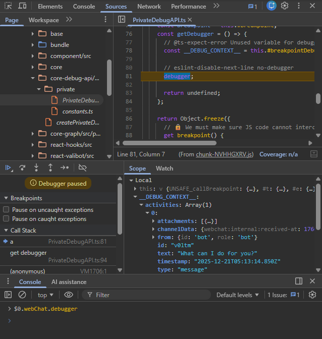

# Debugging

Web Chat supports debugging through F12 DevTools.

## HTML elements

The following table list HTML elements that support debugging.

| Component      | CSS selector | Description                                |
| -------------- | ------------ | ------------------------------------------ |
| Root container | `.webchat`   | Contains data about the whole conversation |
| Activity       | `article`    | Contains data about the specific activity  |

To select the component, use the DevTools Element panel and click on the corresponding element.

## APIs

### Break into debugger

> Note: this method will not work when Content Security Policy is enabled without `script-src unsafe-eval`. We do not recommend the policy to be enabled. In such scenario, use the `debug()` method instead.

To break into the debugger for a specific element:

1. Press <kbd>F12</kbd> to open Chrome DevTools
2. In the Elements pane, click on the element to break into
3. Switch to Console pane, type `$0.webChat.debugger`

Then, it should break into the debugger.



### Breakpoints

Use DevTools Console `debug()` to attach a debugger to specific breakpoint function.

| Component      | CSS selector | Breakpoint         | Description              |
| -------------- | ------------ | ------------------ | ------------------------ |
| Root container | `.webchat`   | `incomingActivity` | When an activity arrive  |
| Activity row   | `article`    | `render`           | When the activity render |

To break when an activity arrive:

1. Press <kbd>F12</kbd> to open Chrome DevTools
2. In the Elements pane, click on the Web Chat root container to break into
   - Or type `inspect($('.webchat'))` to select the first root container on the page
3. Switch to Console pane, type `debug($0.webChat.breakpoint.incomingActivity)`

When an activity arrive, it will automatically break into the debugger.

When using breakpoints, debugger may provide additional diagnostic data related to the triggering scenario.

### Debug context

While in the debugger, the `__DEBUG_CONTEXT__` variable contains various data useful for diagnostic purpose.

| Component      | CSS selector | Debug context | Description                      |
| -------------- | ------------ | ------------- | -------------------------------- |
| Root container | `.webchat`   | `activities`  | All messages in the chat history |
| Activity row   | `article`    | `activity`    | The current message              |

## Recipes

### Break into debugger of the first instance of Web Chat on the page

```js
$('.webchat').webChat.debugger;
```

### Break into debugger of the last activity on the page

```js
$$('article').at(-1).webChat.debugger;
```

Note: `$$()` will select all elements and put them in an array, while `$()` select the first occurrence.

### Break into debugger when an activity arrive

```js
debug($('.webchat').webChat.breakpoint.incomingActivity);
```
