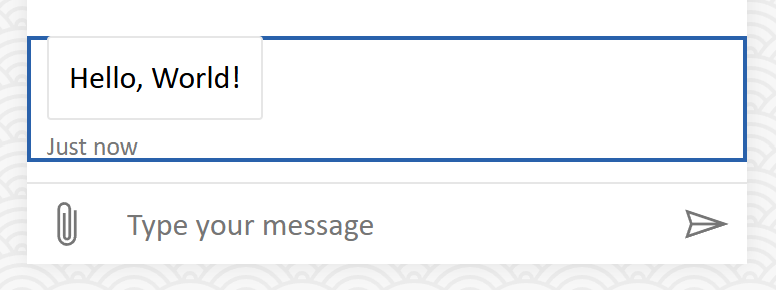

# Middleware

Middleware serves as a core element of Web Chat's architecture, enabling deep and cascaded UI customization.

Middleware operates in a cascading sequence, where the execution order plays a critical role. An upstream middleware can influence whether and how the downstream middleware renders. Middleware can perform the following operations:

- Add new UI
- Remove existing UI
- Replace existing UI
- Decorate existing UI

## What is polymiddleware?

Polymiddleware is our unified architecture for middleware. All middleware will be passed to a single `polymiddleware` prop.

```tsx
function MyChatUI() {
  const polymiddleware = useMemo(
    () => [
      createActivityPolymiddleware(
        next => request =>
          request.activity.type === 'event'
            ? // Handle rendering of event activity thru <EventActivity activity={request.activity}>.
              reactComponent(EventActivity, { activity: request.activity })
            : // Continue downstream.
              next(request)
      )
      createActivityPolymiddleware(...),
      createActivityPolymiddleware(...),

      // Handle rendering of error box.
      createErrorBoxPolymiddleware(...)
    ],
    []
  );

  return (
    <ReactWebChat
      polymiddleware={polymiddleware}
      // ... other props ...
    />
  );
}
```

> Legacy middleware are polyfilled to `polymiddleware` automatically until they reached end of support. See [this section for deprecation dates](#when-will-legacy-middleware-removed).

### List of polymiddleware types

> We are working on migrating all legacy middleware to polymiddleware.

The following are supported polymiddleware types:

- Activity (PR [#5515](https://github.com/microsoft/BotFramework-WebChat/pull/5515))
- Error box (PR [#5515](https://github.com/microsoft/BotFramework-WebChat/pull/5515))

## Recipes

### Show channel message as a badge

This sample demonstrates the following:

- Add a new activity middleware component for a specific type of activity

#### Activity payload

```json
{
   "from": { "id": "channel", "role": "channel" },
   "text": "An agent has joined the conversation",
   "type": "message"
}
```

#### Screenshot


#### Code snippet

```tsx
import ReactWebChat, { createStoreWithOptions } from 'botframework-webchat';
import { type WebChatActivity } from 'botframework-webchat-core';
import {
   activityComponent,
   createActivityPolymiddleware,
   type ActivityPolymiddlewareProps
} from 'botframework-webchat/middleware';
import React, { memo } from 'react';
import { render } from 'react-dom';

type ChannelMessageProps = ActivityPolymiddlewareProps & {
   readonly activity: WebChatActivity & {
      type: 'message';
   };
};

const ChannelMessage = memo<ChannelMessageProps>(function ChannelMessage({ activity }) {
   return (
      <div className="channel-message">
         <div className="channel-message__body">{activity.text}</div>
      </div>
   );
});

const polymiddleware = [
   createActivityPolymiddleware(next => request => {
      const { activity } = request;

      if (activity.from.role === 'channel' && activity.type === 'message') {
         return activityComponent(ChannelMessage, { activity });
      }

      return next(request);
   })
];
```

### Decorate activity with a border

This sample demonstrates the following:

- Decorate an activity
- Use [hooks](./HOOKS.md#usestyleoptions) within the activity middleware component

#### Screenshot



#### Code snippet

```tsx
import ReactWebChat, { createStoreWithOptions, hooks } from 'botframework-webchat';
import {
   activityComponent,
   createActivityPolymiddleware,
   type ActivityPolymiddlewareProps,
   type ActivityPolymiddlewareRenderer
} from 'botframework-webchat/middleware';
import React, { Fragment, memo, useMemo } from 'react';
import { render } from 'react-dom';

const { useStyleOptions } = hooks;

type MessageBorderProps = ActivityPolymiddlewareProps & {
   readonly render: ActivityPolymiddlewareRenderer | undefined;
};

const MessageBorder = memo<MessageBorderProps>(function MessageBorder({ render }) {
   const [{ accent }] = useStyleOptions();

   const style = useMemo(() => ({ outlineColor: accent }), [accent]);

   return (
      <div className="message-border" style={style}>
         <Fragment>{render?.({})}</Fragment>
      </div>
   );
});

const polymiddleware = [
   createActivityPolymiddleware(next => request => {
      const { activity } = request;

      if (activity.type === 'message') {
         const render = next(request)?.render;

         return activityComponent<MessageBorderProps>(MessageBorder, {
            render
         });
      }

      return next(request);
   })
];
```

## Features

### Using the new `<XXXPolymiddlewareProxy>`

Every type of polymiddleware now comes with its corresponding proxy component. It is the easiest way to render a polymiddleware.

```tsx
const ActivityPolymiddlewareProxy: ComponentType<{ readonly activity: WebChatActivity }>;
```

The following code demonstrates using `<ActivityPolymiddlewareProxy>` to render an activity.

<!-- prettier-ignore-start -->
```tsx
function MyComponent({ activity }: { readonly activity: WebChatActivity }) {
  return <ActivityPolymiddlewareProxy activity={activity} />;
}
```
<!-- prettier-ignore-end -->

Refer to [this section](#when-to-use-usebuildrenderxxxcallback-vs-xxxpolymiddlewareproxy) to determine whether to use the hook or the proxy component.

### Mixing polymiddleware with legacy middleware

> Notes: legacy middleware is deprecated and will be removed on or after 2027-08-16.

The following code snippet a legacy activity middleware followed by polymiddleware.

```tsx
const MyActivity = ({ request }) =>
  <div className="polymiddleware">{request.activity.text}</div>

const polymiddleware = [
  // Legacy activity middleware
  createActivityPolymiddlewareFromLegacy(() => next => request => {
    const child = next(request);

    return () => <div className="legacy">{child?.()}</div>;
  },
  // Polymiddleware handling activity request
  createActivityPolymiddleware(next => request => activityComponent(MyActivity, { request }))
]
```

For a message activity of "Hello, World!", it will render:

```html
<div class="legacy">
   <div class="polymiddleware">Hello, World!</div>
</div>
```

## Behaviors

### When will legacy middleware be removed?

We introduced polymiddleware in 2025-08-16. Based on our 2-year deprecation rule, legacy middleware will be removed on or after 2027-08-16. The following table should deprecation dates for various legacy middleware.

| Legacy middleware            | Remove on or after |
| ---------------------------- | ------------------ |
| Activity                     | 2027-08-16         |
| Activity status              | (TBD)              |
| Attachment                   | (TBD)              |
| Attachment for screen reader | (TBD)              |
| Avatar                       | (TBD)              |
| Card action                  | (TBD)              |
| Group activities             | (TBD)              |
| Scroll to end button         | (TBD)              |
| Send box                     | (TBD)              |
| Send box toolbar             | (TBD)              |
| Toast                        | (TBD)              |
| Typing indicator             | (TBD)              |

### Polymiddleware vs. legacy middleware

Polymiddleware is a unification of multiple legacy middleware into a single prop.

Previously, legacy middleware would sometimes return a render function and other times return a React component. Polymiddleware standardizes this behavior by requiring all middleware to return results created using a factory function.

Polymiddleware enforces immutability of requests. Unlike legacy middleware, an upstreamer in polymiddleware is prohibited from passing a modified request to a downstreamer.

### Why we think polymiddleware is better?

Since late 2018, we start adopting middleware programming pattern for UI customization. At the time, React hooks is still in its womb. Over the past 7.5 years of journey, we learnt a lot. Polymiddleware combined all our learnings and is our mature approach for deep customization.

- In other languages, middleware is called "chain of responsibility"
   - Unique characteristics in Web Chat: bidirectional, synchronous, early termination
   - The economy of middleware/chain-of-responsibility in plain English
      - "In Web Chat, result is a render function"
      - "Handler process a request and return a result"
      - "Enhancer is a handler working in a chain: it process the request, pass it to the next enhancer to process, when it return, process it again, and then return"
      - "Middleware initialize the chain of enhancers"
      - "`applyMiddleware()` compile middleware back to a single handler"
- Allowing middleware to override request improves flexibility but also impact debuggability
   - When a middleware in the chain is bugged, rendering could become inconsistent
   - One middleware could change activity type and cause havoc
- Middleware should return render function than a React component
   - Impossible to set a dynamic value as a default prop value in React component without wasted rendering and various performance issues
      - Binding props to a component always re-render despite no actual value change
   - Render function cannot use hooks
   - Render function and React component can be transformed to each other
   - Ideal scenario: web devs pass a React component, Web Chat render using render function
- Ability to use hooks in middleware will reduce prop-passing and result in cleaner interface
- Clear distinction between build-time and render-time
   - Request is a build-time variable and primarily used to "decide whether middleware should add/remove/replace/decorate UI"
   - Props and hooks are render-time variable and is for "how to render the UI"
- All UI-rendering middleware should share same API signature
   - Card action and group activity middleware could be exempted because they are not UI-rendering
- Versioning API change is difficult
   - Factory function can help backward and forward compatibility, similar to building a SDK for an API
- Props should be hidden by using wrapping React context
- Flavor of rendering should be part of the request but not a separate middleware
   - "Attachment middleware for screen reader" could be avoided by adding a "for screen reader" flag in the request
- Everything should be a middleware, whether they are concrete (such as button and icon) or composed (such as send box, which is composed by text box and send button)
- Error boundary should be the topmost decorative middleware in the chain
- When re-rendering is needed due to middleware change, its corresponding callback hook should be invalidated
   - When no middleware change, the callback hook should never be invalidated
- To render a middleware with a request, it can be either done by calling a callback hook, or rendering a proxy component

### Polyfilling legacy middleware

Legacy middleware passed to deprecating props such as `activityMiddleware` will be polyfilled to polymiddleware and placed after other polymiddleware passed via the `polymiddleware` prop. In other words, legacy middleware has lower priority than polymiddleware.

Special polymiddleware factory functions such as `createActivityPolymiddlewareFromLegacy()` allow input of legacy middleware and output as polymiddleware. This helps the transition period. However, these special factory functions is also marked as deprecated.

### Why `createActivityPolymiddlewareFromLegacy()` accepts an array of legacy middleware instead of one?

Polymiddleware enforces immutability of requests, which differs from the behavior of legacy middleware.

When multiple legacy middleware are passed as an array to `createActivityPolymiddlewareFromLegacy()`, they are combined into a single polymiddleware. This allows requests to be modified between legacy middleware, provided they are part of the array.

### When to use `useBuildRenderXXXCallback()` vs. `<XXXPolymiddlewareProxy>`?

Their main differences:

- `useBuildRenderXXXCallback()` allows precise render control
   - Developers can control how the render function is being used and what to do if the polymiddleware decided not to render the activity
- `<XXXPolymiddlewareProxy>` always render an element
   - If the polymiddleware decided not to render, the proxy will still render an empty/headless element (function component returning `null`)
