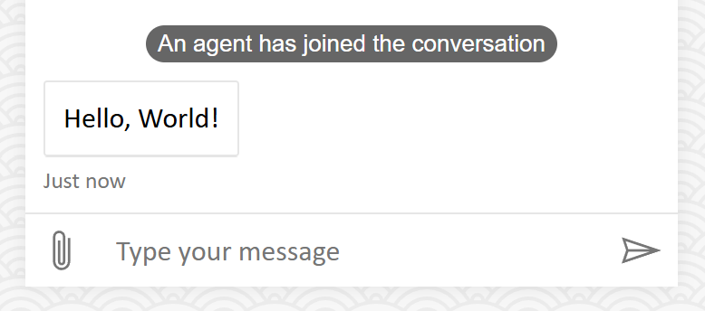

# Middleware

Middleware serves as a core element of Web Chat's architecture, enabling deep and cascaded UI customization.

<!-- TODO: More docs -->

## Recipes

### Show channel message as a badge

This sample demonstrates the following:

- Add a new activity middleware component for a specific type of activity

#### Activity payload

```json
{
   "from": { "id": "channel", "role": "channel" },
   "text": "An agent has joined the conversation",
   "type": "message"
}
```

#### Screenshot



#### Code snippet

```tsx
import ReactWebChat, { createStoreWithOptions } from 'botframework-webchat';
import { type WebChatActivity } from 'botframework-webchat-core';
import {
   activityComponent,
   createActivityPolymiddleware,
   type ActivityPolymiddlewareProps
} from 'botframework-webchat/middleware';
import React, { memo } from 'react';
import { render } from 'react-dom';

type ChannelMessageProps = ActivityPolymiddlewareProps & {
   readonly activity: WebChatActivity & {
      type: 'message';
   };
};

const ChannelMessage = memo<ChannelMessageProps>(function ChannelMessage({ activity }) {
   return (
      <div className="channel-message">
         <div className="channel-message__body">{activity.text}</div>
      </div>
   );
});

const polymiddleware = [
   createActivityPolymiddleware(next => request => {
      const { activity } = request;

      if (activity.from.role === 'channel' && activity.type === 'message') {
         return activityComponent(ChannelMessage, { activity });
      }

      return next(request);
   })
];
```

### Decorate activity with a border

This sample demonstrates the following:

- Decorate an activity
- Use [hooks](./HOOKS.md#usestyleoptions) within the activity middleware component

#### Screenshot


#### Code snippet

```tsx
import ReactWebChat, { createStoreWithOptions, hooks } from 'botframework-webchat';
import {
   activityComponent,
   createActivityPolymiddleware,
   type ActivityPolymiddlewareProps,
   type ActivityPolymiddlewareRenderer
} from 'botframework-webchat/middleware';
import React, { Fragment, memo, useMemo } from 'react';
import { render } from 'react-dom';

const { useStyleOptions } = hooks;

type MessageBorderProps = ActivityPolymiddlewareProps & {
   readonly render: ActivityPolymiddlewareRenderer | undefined;
};

const MessageBorder = memo<MessageBorderProps>(function MessageBorder({ render }) {
   const [{ accent }] = useStyleOptions();

   const style = useMemo(() => ({ outlineColor: accent }), [accent]);

   return (
      <div className="message-border" style={style}>
         <Fragment>{render?.({})}</Fragment>
      </div>
   );
});

const polymiddleware = [
   createActivityPolymiddleware(next => request => {
      const { activity } = request;

      if (activity.type === 'message') {
         const render = next(request)?.render;

         return activityComponent<MessageBorderProps>(MessageBorder, {
            render
         });
      }

      return next(request);
   })
];
```

## Behaviors

### Polymiddleware vs. legacy middleware

Polymiddleware is a unification of multiple legacy middleware into a single prop.

Previously, legacy middleware would sometimes return a render function and other times return a React component. Polymiddleware standardizes this behavior by requiring all middleware to return results created using a factory function.

Polymiddleware enforces immutability of requests. Unlike legacy middleware, an upstreamer in polymiddleware is prohibited from passing a modified request to a downstreamer.

### Polyfilling legacy middleware

Legacy middleware passed to deprecating props such as `activityMiddleware` will be polyfilled to polymiddleware after other polymiddleware passed via the `polymiddleware` prop.

Special polymiddleware factory functions allow input of legacy middleware and output as polymiddleware. This helps the transition period. However, these special factory functions is also marked as deprecated.

### Why `createActivityPolymiddlewareFromLegacy` accepts an arary of legacy middleware instead of one?

Polymiddleware enforces immutability of requests, which differs from the behavior of legacy middleware.

When multiple legacy middleware are passed as an array into `createActivityPolymiddlewareFromLegacy()`, they are combined into a single polymiddleware. This allows requests to be modified between legacy middleware, provided they are part of the array.
