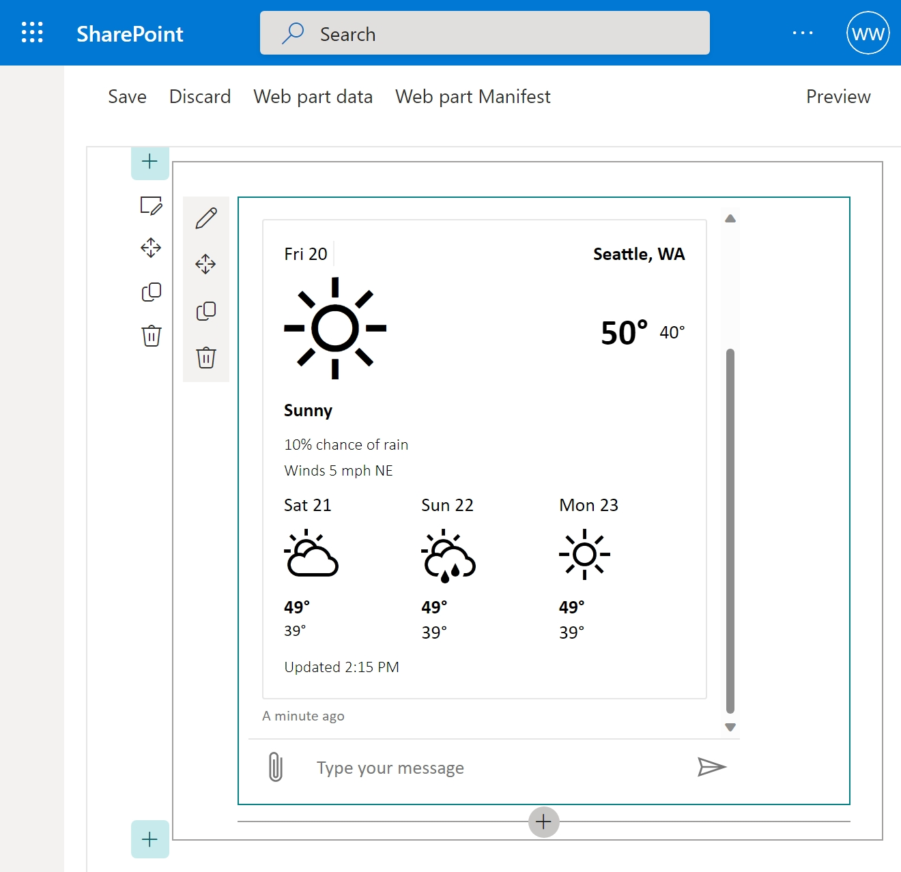

# Sample - Hosting on SharePoint as web part using React template

A simple SharePoint web part using React template hosting Web Chat from NPM. The SharePoint Framework (SPFx) development environment is hosted under Docker.



# How to run locally

> Note: Please install Docker before running the following steps.

-  Fork this repository
-  Navigate to `/Your-Local-WebChat/samples/01.getting-started/l.sharepoint-web-part` in command line
-  Run `npm run build`
-  Run `npm start`
-  Browse to [https://localhost:4321/temp/manifests.js](https://localhost:4321/temp/manifests.js) and trust the self-signed certificate
   -  When the browser show "Your connection isn't private" page, type `thisisunsafe` on your keyboard
   -  It should load the JavaScript file
-  Browse to https://&lt;your-sharepoint&gt;.sharepoint.com/sites/&lt;your-site&gt;/\_layouts/15/workbench.aspx
-  Add web part
-  Select "Web Chat"
-  Click the "Edit" button next to Web Chat
-  In the properties panel, put your Direct Line token to the "Token" field
-  Refresh the page

> It is **never recommended** to put the Direct Line secret in the browser or client app. To learn more about secrets and tokens for Direct Line, visit [this tutorial on authentication](https://docs.microsoft.com/en-us/azure/bot-service/rest-api/bot-framework-rest-direct-line-3-0-authentication).

# Things to try out

-  Type `help`: you should see a full list of MockBot features
-  Type `markdown`: you should see the sample of Markdown
-  Type `card weather`: you should see a weather card built using Adaptive Cards
-  Type `layout carousel`: you should see a carousel of cards
   -  Resize the window and see how the carousel changes size

# Code

> Jump to [completed code](#completed-code) to see the end-result.

## Getting started

This code host a full-feature Web Chat as a SharePoint web part using React template. Web Chat will be installed through NPM with all customization options available.

### Preparation

SPFx is hosted in Docker to enable cloud development. The `Dockerfile` will do the followings to prepare the development environment:

1. Download [`gulp@4`](https://npmjs.com/package/gulp), [`yo` (Yeoman)](https://yeoman.io/), and [`@microsoft/generator-sharepoint` (SharePoint scaffold)](https://npmjs.com/package/@microsoft/generator-sharepoint)
1. Create a new user account `spfx` (requirement of Yeoman when running under Docker)
1. Create a new directory `/usr/app/spfx/`
1. Run Yeoman with SharePoint scaffold with the following answers
   -  What is your solution name? `spfx`
   -  Which type of client-side component to create? `WebPart`
   -  What is your Web part name? `Web Chat`
   -  Which template would you like to use? `React`
1. Install tooling [`concurrently`](https://npmjs.com/package/concurrently), [`http-proxy-middleware`](https://npmjs.com/package/http-proxy-middleware) and [`selfsigned`](https://npmjs.com/package/selfsigned)
1. Run `gulp trust-dev-cert` to create a self-signed certificate for Webpack/SPFx development server
1. Copy the reverse proxy
   -  Webpack/SPFx development server only listen to `https://localhost/` but not `https://0.0.0.0/`, the host of the Docker will not able to access it
   -  A reverse proxy (`proxy.js`) to proxy requests from `https://0.0.0.0:54321/` to `https://localhost:4321`
   -  When running the Docker image, port 54321 will be mapped back to 4321 as SharePoint workbench only accept development server from https://localhost:4321/
1. Install [Web Chat](https://github.com/microsoft/BotFramework-WebChat/)
1. Copy web part code to the container
1. Set the entrypoint to run both reverse proxy and Webpack/SPFx development server (via `gulp serve`)
   -  `--nobrowser` is added as the Docker image does not have any browsers installed

When running the Docker image, it will expose:

-  Port 54321, which will proxy to Webpack/SPFx development server at https://localhost:4321/
   -  While running `npm start`, this port will be mapped to 4321 via `docker run --publish 4321:54321 ...`
   -  This port will use a different self-signed certificate
-  Port 35729, which will point to LiveReload server

### Web part code

These are based on web part sample code from SharePoint scaffold and modified to host Web Chat.

#### `webparts/webChat/components/IWebChatProps.ts`

Added two props, `domain` and `token`.

```diff
  export interface IWebChatProps {
    description: string;
+   domain: string;
    isDarkTheme: boolean;
    environmentMessage: string;
    hasTeamsContext: boolean;
+   token: string;
    userDisplayName: string;
  }
```

#### `webparts/webChat/components/WebChat.module.scss`

The stylesheet is being replaced.

```css
@import '~office-ui-fabric-react/dist/sass/References.scss';

.webChat {
   height: 800px;
   width: 360px;
}
```

#### `webparts/webChat/components/WebChat.tsx`

The component code is being replaced by a React function component. It connects to Direct Line or Direct Line ASE (if `domain` prop is specified).

<!-- prettier-ignore-start -->
```ts
import { useEffect, useState } from 'react';
import * as React from 'react';
import ReactWebChat, { createDirectLine, createDirectLineAppServiceExtension } from 'botframework-webchat';

import { IWebChatProps } from './IWebChatProps';
import styles from './WebChat.module.scss';

import type { VFC } from 'react';

const WebChat: VFC<IWebChatProps> = ({ domain, token }) => {
  const [directLine, setDirectLine] = useState();

  useEffect(() => {
    (async function () {
      setDirectLine(
        domain ? await createDirectLineAppServiceExtension({ domain, token }) : createDirectLine({ token })
      );
    })();
  }, [setDirectLine]);

  return <section className={styles.webChat}>{!!directLine && <ReactWebChat directLine={directLine} />}</section>;
};

export default WebChat;
```
<!-- prettier-ignore-end -->

#### `webparts/webChat/loc/en-us.js`

Added localized strings for new property in the properties panel.

```diff
  define([], function () {
    return {
      AppLocalEnvironmentSharePoint: 'The app is running on your local environment as SharePoint web part',
      AppLocalEnvironmentTeams: 'The app is running on your local environment as Microsoft Teams app',
      AppSharePointEnvironment: 'The app is running on SharePoint page',
      AppTeamsTabEnvironment: 'The app is running in Microsoft Teams',
      BasicGroupName: 'Group Name',
      DescriptionFieldLabel: 'Description Field',
+     DomainFieldLabel: 'Domain (for Direct Line ASE)',
      PropertyPaneDescription: 'Description',
+     TokenFieldLabel: 'Token'
    };
  });
```

#### `webparts/webChat/loc/mystrings.d.ts`

Added typing for localized strings for new properties.

```diff
  declare interface IWebChatWebPartStrings {
    AppLocalEnvironmentSharePoint: string;
    AppLocalEnvironmentTeams: string;
    AppSharePointEnvironment: string;
    AppTeamsTabEnvironment: string;
    BasicGroupName: string;
    DescriptionFieldLabel: string;
+   DomainFieldLabel: string;
    PropertyPaneDescription: string;
+   TokenFieldLabel: string;
  }

  declare module 'WebChatWebPartStrings' {
    const strings: IWebChatWebPartStrings;
    export = strings;
  }
```

### `webparts/webChat/WebChatWebPart.manifest.json`

Added default values for new properties.

```diff
  {
    "$schema": "https://developer.microsoft.com/json-schemas/spfx/client-side-web-part-manifest.schema.json",
    ...
    "preconfiguredEntries": [
      {
        "groupId": "5c03119e-3074-46fd-976b-c60198311f70", // Other
        "group": { "default": "Other" },
        "title": { "default": "Web Chat" },
        "description": { "default": "Web Chat description" },
        "officeFabricIconFontName": "Page",
        "properties": {
          "description": "Web Chat",
+         "domain": "",
+         "token": ""
        }
      }
    ]
  }
```

### `webparts/webChat/WebChatWebPart.ts`

Added two properties: `domain` and `token`.

```diff
  ...
  protected getPropertyPaneConfiguration(): IPropertyPaneConfiguration {
    return {
      pages: [
        {
          header: {
            description: strings.PropertyPaneDescription
          },
          groups: [
            {
              groupName: strings.BasicGroupName,
              groupFields: [
                PropertyPaneTextField('description', {
                  label: strings.DescriptionFieldLabel
                }),
+               PropertyPaneTextField('domain', {
+                 label: strings.DomainFieldLabel
+               }),
+               PropertyPaneTextField('token', {
+                 label: strings.TokenFieldLabel
+               })
              ]
            }
          ]
        }
      ]
    };
  }
  ...
```

## Completed code

Here is the finished `Dockerfile`:

```dockerfile
# Setting to a different base image to secure your container supply chain.
ARG REGISTRY=docker.io
ARG BASE_IMAGE=$REGISTRY/node:16

FROM $BASE_IMAGE

EXPOSE 54321 35729

RUN npm install --location=global gulp@4 yo @microsoft/generator-sharepoint@1.15.0

RUN useradd --create-home --shell /bin/bash spfx && \
    usermod -aG sudo spfx && \
    mkdir -p /usr/app/spfx/ && \
    chown -R spfx:spfx /usr/app && \
    cd /usr/app/spfx
USER spfx

RUN mkdir -p /usr/app/spfx/

WORKDIR /usr/app/
RUN yo @microsoft/sharepoint --no-insight --skip-install --component-type webpart --component-name WebChat --framework react --solution-name spfx

WORKDIR /usr/app/spfx/
RUN npm install --save-dev concurrently http-proxy-middleware selfsigned
RUN gulp trust-dev-cert
ADD src/proxy.js /usr/app/spfx/proxy.js

# Due to some problems in esbuild@0.12.15, either;
# 1. It has to be installed before botframework-webchat, or;
# 2. Install botframework-webchat, it will fail, then install again will succeed
RUN npm install esbuild@0.12.15

RUN npm install botframework-webchat

ADD --chown=spfx:spfx src/spfx/src/webparts/webChat /usr/app/spfx/src/webparts/webChat

ENTRYPOINT npx concurrently "node proxy" "gulp serve --nobrowser"
```

# Further reading

-  https://docs.microsoft.com/en-us/sharepoint/dev/spfx/web-parts/get-started/build-a-hello-world-web-part
-  https://docs.microsoft.com/en-us/sharepoint/dev/spfx/yeoman-generator-for-spfx-intro
-  https://github.com/compulim/experiment-spfx-webchat/
-  https://github.com/pnp/docker-spfx

## Full list of Web Chat hosted samples

View the list of [available Web Chat samples](https://github.com/microsoft/BotFramework-WebChat/tree/main/samples)
