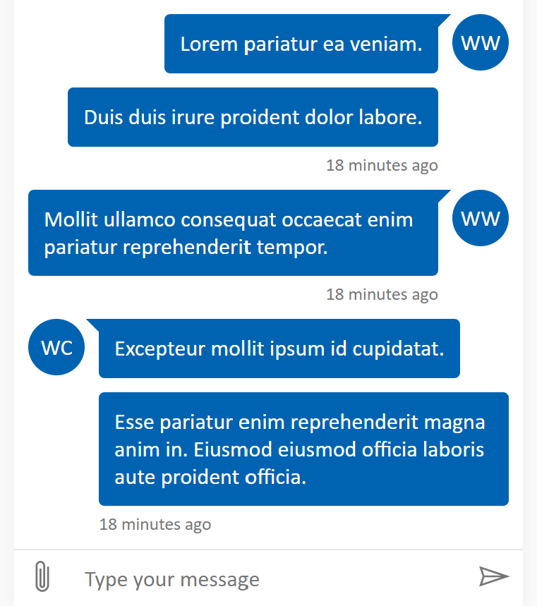

# Sample - Activity grouping

This sample shows how to customize the activity grouping behavior.



# Test out the hosted sample

-  [Try out MockBot](https://microsoft.github.io/BotFramework-WebChat/02.branding-styling-and-customization/j.activity-grouping)

# How to run

-  Fork this repository
-  Navigate to `/Your-Local-WebChat/samples/02.branding-styling-and-customization/j.activity-grouping` in command line
-  Run `npx serve`
-  Browse to [http://localhost:5000/](http://localhost:5000/)

# Things to try out

1. Type `echo Hello, World!` to the bot
1. Type `proactive` to the bot
1. Resize the browser window

# Code

> Jump to [completed code](#completed-code) to see the end-result `index.html`.

## Getting started

> Note: this sample is based from [`01.getting-started/a.full-bundle`](https://github.com/microsoft/BotFramework-WebChat/tree/main/samples/01.getting-started/a.full-bundle).

This sample will customize the activity grouping behavior, avatar UI, and bubble UI.

### Styling the container

```css
html,
body {
   height: 100%;
}

body {
   background-color: #fafafa;
   margin: 0;
}

#webchat {
   height: 100%;
   margin: 0;
   transition-duration: 0.5s;
   transition-property: margin;
}

.webchat__chat {
   background-color: white;
   box-shadow: 0 0 10px rgba(0, 0, 0, 0.05);
   display: flex;
   flex-direction: column;
   height: 100%;
   margin: auto;
   max-width: 360px;
   min-width: 360px;
   transition-duration: 0.5s;
   transition-property: max-width, min-width, width;
}

@media (min-width: 720px) {
   #webchat {
      margin: 0 10px;
   }

   .webchat__chat {
      max-width: 480px;
      min-width: 480px;
      width: 480px;
   }
}
```

### Setting `styleOptions`

The style options in the sample are set to the following:

-  Bot avatar initials are set to "Bot"
-  User avatar initials are set to "You"
-  For both sides:
   -  Bubble background is `#F4F4F4`
   -  Bubble border is 2 pixels wide of color `#F4F4F4`
   -  Bubble radius is 4 pixels
   -  Bubble nub is 10 pixels in size and aligned to top
-  Timestamps within 3 seconds are grouped
   -  By default, timestamps are always grouped regardless of their intervals
-  The avatar is shown in every timestamp/status group, by default
   -  `"sender"` shows the avatar in every sender group
   -  `true` shows the avatar on every activity

```diff
  const res = await fetch('https://webchat-mockbot.azurewebsites.net/directline/token', { method: 'POST' });
  const { token } = await res.json();

  renderWebChat(
    {
+     className: 'webchat__chat',
-     directLine: createDirectLine({ token })
+     directLine: createDirectLine({ token }),
+     styleOptions: {
+       botAvatarInitials: 'Bot',
+       userAvatarInitials: 'You',
+
+       bubbleBackground: '#F4F4F4',
+       bubbleBorderColor: '#F4F4F4',
+       bubbleBorderRadius: 4,
+       bubbleBorderWidth: 2,
+       bubbleNubOffset: 0,
+       bubbleNubSize: 10,
+
+       bubbleFromUserBackground: '#F4F4F4',
+       bubbleFromUserBorderColor: '#F4F4F4',
+       bubbleFromUserBorderRadius: 4,
+       bubbleFromUserBorderWidth: 2,
+       bubbleFromUserNubOffset: 0,
+       bubbleFromUserNubSize: 10,
+
+       groupTimestamp: 3000,
+       showAvatarInGroup: 'status'
+     }
    },
    document.getElementById('webchat')
  );
```

## Completed code

Here is the finished `index.html`:

<!-- prettier-ignore-start -->
```html
<!DOCTYPE html>
<html lang="en-US">
  <head>
    <title>Web Chat: Grouping activity</title>
    <meta name="viewport" content="width=device-width, initial-scale=1.0" />
    <script crossorigin="anonymous" src="https://unpkg.com/core-js@2/client/core.min.js"></script>
    <script crossorigin="anonymous" src="https://unpkg.com/regenerator-runtime@0.13.3/runtime.js"></script>

    <script crossorigin="anonymous" src="https://unpkg.com/@babel/standalone@7.8.7/babel.min.js"></script>
    <script crossorigin="anonymous" src="https://unpkg.com/react@16.8.6/umd/react.development.js"></script>
    <script crossorigin="anonymous" src="https://unpkg.com/react-dom@16.8.6/umd/react-dom.development.js"></script>
    <script crossorigin="anonymous" src="https://unpkg.com/classnames@2.2.6"></script>
    <script crossorigin="anonymous" src="https://cdn.botframework.com/botframework-webchat/latest/webchat.js"></script>
    <style>
      html,
      body {
        height: 100%;
      }

      body {
        background-color: #fafafa;
        margin: 0;
      }

      #webchat {
        height: 100%;
        margin: 0;
        transition-duration: 0.5s;
        transition-property: margin;
      }

      .webchat__chat {
        background-color: white;
        box-shadow: 0 0 10px rgba(0, 0, 0, 0.05);
        display: flex;
        flex-direction: column;
        height: 100%;
        margin: auto;
        max-width: 360px;
        min-width: 360px;
        transition-duration: 0.5s;
        transition-property: max-width, min-width, width;
      }

      @media (min-width: 720px) {
        #webchat {
          margin: 0 10px;
        }

        .webchat__chat {
          max-width: 480px;
          min-width: 480px;
          width: 480px;
        }
      }
    </style>
  </head>
  <body>
    <div id="webchat"></div>
    <script type="text/babel" data-presets="env,stage-3,react">
      (async function () {
        const {
          React: { useMemo },
          WebChat: { createDirectLine, renderWebChat }
        } = window;

        const res = await fetch('https://webchat-mockbot.azurewebsites.net/directline/token', { method: 'POST' });
        const { token } = await res.json();

        renderWebChat(
          {
            className: 'webchat__chat',
            directLine: createDirectLine({ token }),
            styleOptions: {
              botAvatarInitials: 'Bot',
              userAvatarInitials: 'You',

              bubbleBackground: '#F4F4F4',
              bubbleBorderColor: '#F4F4F4',
              bubbleBorderRadius: 4,
              bubbleBorderWidth: 2,
              bubbleNubOffset: 0,
              bubbleNubSize: 10,

              bubbleFromUserBackground: '#F4F4F4',
              bubbleFromUserBorderColor: '#F4F4F4',
              bubbleFromUserBorderRadius: 4,
              bubbleFromUserBorderWidth: 2,
              bubbleFromUserNubOffset: 0,
              bubbleFromUserNubSize: 10,

              groupTimestamp: 3000,
              showAvatarInGroup: 'timestamp'
            }
          },
          document.getElementById('webchat')
        );
      })().catch(err => console.error(err));
    </script>
  </body>
</html>
```
<!-- prettier-ignore-end -->

# Further reading

## Full list of Web Chat hosted samples

View the list of [available Web Chat samples](https://github.com/microsoft/BotFramework-WebChat/tree/main/samples)
